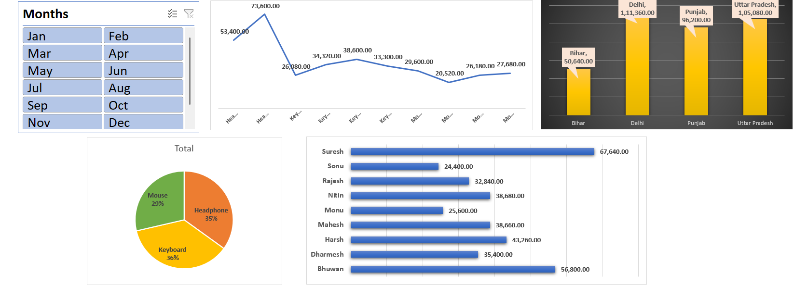

# 📊 Excel Sales Dashboard

An interactive **Sales Dashboard built using Microsoft Excel** to analyze sales performance across products, product categories, states, sales representatives, and months.

## 📌 Project Overview

This project transforms raw sales data into an interactive dashboard using **Excel Pivot Tables, Pivot Charts, and Slicers**.

The dashboard provides a visual overview of sales performance and helps identify trends, top-performing products, sales representatives, and high-performing states.

## 📷 Dashboard Preview



## 🎯 Project Objectives

- Analyze overall sales performance
- Track sales trends across months
- Compare sales across different product categories
- Analyze sales performance by state
- Compare sales representatives based on sales
- Identify top-performing products
- Build an interactive and easy-to-understand sales dashboard

## 🗂️ Dataset

The dataset contains **183 sales records** with the following columns:

| Column | Description |
|---|---|
| Date | Date of the sale |
| Product | Name/model of the product |
| Type | Product category |
| Qty | Quantity sold |
| Rate | Price per unit |
| Sales Rep. | Sales representative |
| State | State where the sale occurred |
| Sales | Total sales amount |

### Product Categories

- Keyboard
- Headphone
- Mouse

### States

- Bihar
- Delhi
- Punjab
- Uttar Pradesh

## 🛠️ Tools & Excel Features Used

- **Microsoft Excel**
- **Pivot Tables**
- **Pivot Charts**
- **Slicers**
- **Excel Formulas**
- **Data Aggregation**
- **Data Visualization**
- **Dashboard Design**

## 📊 Dashboard Components

### 1. Monthly Sales Trend

A line chart is used to visualize sales performance across different months and identify changes in sales over time.

### 2. Sales by State

A column chart compares sales across different states, helping identify the strongest-performing regions.

### 3. Sales by Product Type

A pie chart shows the contribution of different product categories:

- Headphone
- Keyboard
- Mouse

### 4. Sales by Sales Representative

A horizontal bar chart compares the sales generated by individual sales representatives.

### 5. Month Slicer

An interactive **Month Slicer** allows users to filter the dashboard and analyze sales for selected months.

## 🔄 Analysis Workflow

```text
Raw Sales Data
       ↓
Data Preparation
       ↓
Pivot Tables
       ↓
Pivot Charts
       ↓
Interactive Slicer
       ↓
Sales Dashboard
       ↓
Business Insights
